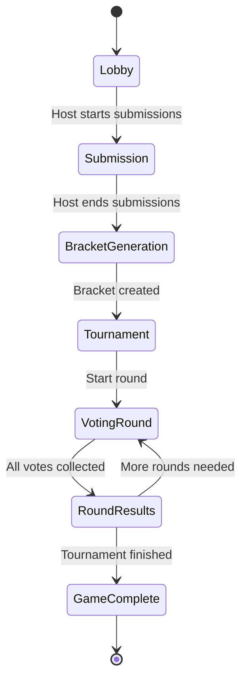

# Bracket Battle Game Design

## Overview

Bracket Battle is a tournament-style voting game built on the existing multiplayer games platform. Players submit entries for a host-defined category, then participate in elimination-style voting to determine the ultimate winner. The game leverages the existing Durable Objects architecture with WebSocket communication for real-time tournament progression.

## Architecture

### System Components

The Bracket Battle game extends the existing architecture with these key components:

```
┌─────────────────┐    ┌──────────────────┐    ┌─────────────────┐
│   Game Client   │◄──►│  GameSession DO  │◄──►│  BracketGame    │
│   (Frontend)    │    │   (WebSocket)    │    │   (Logic)       │
└─────────────────┘    └──────────────────┘    └─────────────────┘
                                │
                                ▼
                       ┌──────────────────┐
                       │  Durable Object  │
                       │     Storage      │
                       └──────────────────┘
```

### Game Flow Architecture



## Components and Interfaces

### 1. BracketGame Class

Extends the existing game pattern following `DrawingGame.ts` structure:

```typescript
export class BracketGame {
  private gameState: GameState;
  private bracketState: BracketGameState;
  
  constructor(gameState: GameState);
  
  // Phase management
  public canStartSubmissions(): boolean;
  public startSubmissions(): void;
  public canEndSubmissions(): boolean;
  public endSubmissions(): void;
  public canStartTournament(): boolean;
  public startTournament(): void;
  
  // Entry management
  public submitEntry(entry: string, playerId: string): boolean;
  public removeEntry(entryId: string, playerId: string): boolean;
  public getPlayerEntries(playerId: string): BracketEntry[];
  
  // Tournament management
  public generateBracket(): void;
  public getCurrentMatches(): BracketMatch[];
  public submitVote(matchId: string, entryId: string, playerId: string): boolean;
  public processRoundResults(): void;
  public advanceToNextRound(): void;
  
  // State queries
  public getBracketStructure(): BracketNode[];
  public getTournamentResults(): TournamentResults;
  public getGameState(): BracketGameState;
}
```

### 2. Data Models

#### Core Game State
```typescript
interface BracketGameState {
  category: string;
  maxEntriesPerPlayer: number;
  phase: 'lobby' | 'submission' | 'bracket_generation' | 'tournament' | 'results';
  
  // Submission phase
  entries: BracketEntry[];
  submissionDeadline?: number;
  
  // Tournament phase
  bracket: BracketNode[];
  currentRound: number;
  totalRounds: number;
  activeMatches: BracketMatch[];
  matchResults: MatchResult[];
  
  // Results
  winner?: BracketEntry;
  finalRankings: BracketEntry[];
  
  // Voting tracking
  playerVotes: Record<string, Record<string, string>>; // playerId -> matchId -> entryId
  spectatorVotes: Record<string, Record<string, string>>;
}

interface BracketEntry {
  id: string;
  text: string;
  submittedBy: string;
  submittedAt: number;
  eliminated?: boolean;
  eliminatedInRound?: number;
}

interface BracketMatch {
  id: string;
  round: number;
  position: number;
  entry1: BracketEntry;
  entry2: BracketEntry;
  votes: Record<string, string>; // voterId -> entryId
  winner?: BracketEntry;
  completed: boolean;
}

interface BracketNode {
  id: string;
  round: number;
  position: number;
  entry?: BracketEntry;
  children?: [BracketNode, BracketNode];
  parent?: BracketNode;
}
```

#### Tournament Bracket Structure
The bracket uses a binary tree structure where:
- Leaf nodes contain initial entries
- Internal nodes represent matches
- Root node contains the tournament winner
- Each node tracks its round and position for UI rendering

### 3. WebSocket Message Extensions

Building on the existing `WebSocketMessage` interface:

```typescript
type BracketGameMessage = 
  | { type: 'set_category'; data: { category: string; maxEntries: number } }
  | { type: 'start_submissions'; data: {} }
  | { type: 'submit_entry'; data: { text: string } }
  | { type: 'remove_entry'; data: { entryId: string } }
  | { type: 'end_submissions'; data: {} }
  | { type: 'start_tournament'; data: {} }
  | { type: 'submit_vote'; data: { matchId: string; entryId: string } }
  | { type: 'bracket_updated'; data: { bracket: BracketNode[]; matches: BracketMatch[] } }
  | { type: 'round_complete'; data: { round: number; results: MatchResult[] } }
  | { type: 'tournament_complete'; data: { winner: BracketEntry; rankings: BracketEntry[] } };
```

### 4. Frontend Components

#### Game Interface Structure
```typescript
class BracketBattleClient {
  private ws: WebSocket;
  private gameState: BracketGameState;
  private playerId: string;
  private isHost: boolean;
  
  // UI Management
  private renderLobby(): void;
  private renderSubmissionPhase(): void;
  private renderTournamentBracket(): void;
  private renderVotingInterface(): void;
  private renderResults(): void;
  
  // User Actions
  public submitEntry(text: string): void;
  public removeEntry(entryId: string): void;
  public submitVote(matchId: string, entryId: string): void;
  
  // Host Actions
  public setCategory(category: string, maxEntries: number): void;
  public startSubmissions(): void;
  public endSubmissions(): void;
  public startTournament(): void;
}
```

## Data Models

### Tournament Bracket Generation

The bracket generation algorithm handles various entry counts:

1. **Power of 2 entries (4, 8, 16, 32, 64)**: Perfect bracket with no byes
2. **Non-power of 2 entries**: Add byes in the first round, distributed evenly
3. **Minimum 4 entries**: Required for meaningful tournament
4. **Maximum 64 entries**: Platform limit for performance

#### Bracket Generation Algorithm
```typescript
function generateBracket(entries: BracketEntry[]): BracketNode[] {
  const entryCount = entries.length;
  const nextPowerOf2 = Math.pow(2, Math.ceil(Math.log2(entryCount)));
  const byeCount = nextPowerOf2 - entryCount;
  
  // Create first round with byes distributed
  const firstRound = distributeEntriesWithByes(entries, byeCount);
  
  // Build bracket tree bottom-up
  return buildBracketTree(firstRound);
}
```

### Voting System

#### Vote Collection Strategy
- **Real-time voting**: Votes processed immediately when received
- **Vote validation**: Prevent duplicate votes per match per player
- **Spectator inclusion**: Spectators can vote with equal weight
- **Automatic advancement**: Matches advance when all participants have voted

#### Vote Tallying
```typescript
interface VoteResult {
  entry1Votes: number;
  entry2Votes: number;
  totalVotes: number;
  winner: BracketEntry;
  margin: number;
}

function tallyVotes(match: BracketMatch): VoteResult {
  const votes = Object.values(match.votes);
  const entry1Votes = votes.filter(v => v === match.entry1.id).length;
  const entry2Votes = votes.filter(v => v === match.entry2.id).length;
  
  return {
    entry1Votes,
    entry2Votes,
    totalVotes: votes.length,
    winner: entry1Votes > entry2Votes ? match.entry1 : match.entry2,
    margin: Math.abs(entry1Votes - entry2Votes)
  };
}
```

## Error Handling

### Validation Rules

#### Entry Submission
- **Text length**: 1-100 characters
- **Entry limit**: Respect `maxEntriesPerPlayer` setting
- **Phase validation**: Only allow submissions during submission phase
- **Duplicate prevention**: Check for identical entries from same player

#### Voting Validation
- **Match existence**: Verify match ID exists and is active
- **Entry validation**: Ensure voted entry is in the specified match
- **Duplicate prevention**: One vote per match per player
- **Phase validation**: Only allow voting during tournament phase

#### Host Actions
- **Permission validation**: Only host can control game phases
- **State validation**: Ensure valid state transitions
- **Minimum requirements**: Enforce minimum entry counts for tournament start

### Error Response Patterns
```typescript
interface GameError {
  type: 'validation_error' | 'permission_error' | 'state_error';
  message: string;
  field?: string;
  code: string;
}

// Example error responses
const ERRORS = {
  ENTRY_TOO_LONG: { type: 'validation_error', message: 'Entry must be 100 characters or less', code: 'ENTRY_TOO_LONG' },
  ENTRY_LIMIT_REACHED: { type: 'validation_error', message: 'Maximum entries per player reached', code: 'ENTRY_LIMIT_REACHED' },
  INVALID_PHASE: { type: 'state_error', message: 'Action not allowed in current game phase', code: 'INVALID_PHASE' },
  NOT_HOST: { type: 'permission_error', message: 'Only the host can perform this action', code: 'NOT_HOST' },
  INSUFFICIENT_ENTRIES: { type: 'state_error', message: 'Need at least 4 entries to start tournament', code: 'INSUFFICIENT_ENTRIES' }
};
```

## Testing Strategy

### Unit Tests

#### BracketGame Logic Tests
```typescript
describe('BracketGame', () => {
  describe('Entry Management', () => {
    test('should accept valid entry submissions');
    test('should reject entries exceeding character limit');
    test('should enforce per-player entry limits');
    test('should prevent submissions outside submission phase');
  });
  
  describe('Bracket Generation', () => {
    test('should generate valid bracket for power-of-2 entries');
    test('should handle non-power-of-2 entries with byes');
    test('should reject tournaments with fewer than 4 entries');
    test('should distribute byes evenly in first round');
  });
  
  describe('Voting System', () => {
    test('should record valid votes');
    test('should prevent duplicate voting');
    test('should correctly tally vote results');
    test('should advance winners to next round');
  });
});
```

#### Frontend Component Tests
```typescript
describe('BracketBattleClient', () => {
  test('should render appropriate UI for each game phase');
  test('should handle WebSocket message updates');
  test('should validate user input before sending');
  test('should display bracket structure correctly');
  test('should show real-time voting progress');
});
```

### Integration Tests

#### WebSocket Communication
- Test complete game flow from lobby to results
- Verify real-time updates reach all connected clients
- Test reconnection handling during active tournaments
- Validate message ordering and consistency

#### Multi-Player Scenarios
- Test concurrent entry submissions
- Test simultaneous voting in multiple matches
- Test spectator participation alongside players
- Test host controls during active gameplay

### Performance Tests

#### Scalability Testing
- Test with maximum entry count (64 entries)
- Test with maximum player count per session
- Measure WebSocket message throughput during voting
- Test bracket rendering performance with large tournaments

#### Memory Usage
- Monitor Durable Object memory usage during tournaments
- Test cleanup of completed game data
- Verify no memory leaks in long-running sessions

## Security Considerations

### Input Validation
- **Entry text sanitization**: Strip HTML, limit special characters
- **Category validation**: Sanitize host-provided category text
- **Rate limiting**: Prevent spam submissions and votes
- **Message size limits**: Enforce maximum WebSocket message sizes

### Game Integrity
- **Vote verification**: Cryptographic vote signatures (future enhancement)
- **Audit trail**: Log all game actions for debugging
- **State consistency**: Validate game state after each operation
- **Rollback capability**: Ability to revert invalid state changes

### Privacy Protection
- **Anonymous spectators**: Allow viewing without player registration
- **Entry attribution**: Option to hide entry submitters until results
- **Vote privacy**: Individual votes not revealed until match completion

## Performance Optimizations

### Real-Time Updates
- **Delta updates**: Send only changed bracket sections
- **Update batching**: Combine multiple state changes into single broadcast
- **Client-side caching**: Cache bracket structure for smooth UI updates
- **Lazy loading**: Load bracket sections as needed for large tournaments

### Memory Management
- **Entry cleanup**: Remove eliminated entries from active memory
- **Vote compression**: Compress historical vote data
- **Session cleanup**: Automatic cleanup of completed tournaments
- **State snapshots**: Periodic state saves for recovery

### Network Optimization
- **Message compression**: Compress large bracket updates
- **Connection pooling**: Reuse WebSocket connections efficiently
- **Heartbeat optimization**: Reduce ping frequency during active voting
- **Bandwidth throttling**: Limit update frequency during high activity