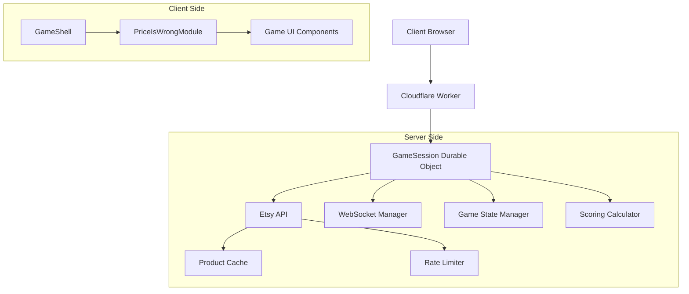

# Design Document - Price Is Weird Game

## Overview

The Price Is Weird is a multiplayer real-time guessing game built on the existing games platform architecture. Players view product images and names from real Etsy listings, guess prices, and earn points based on accuracy. The game leverages the Etsy Open API v3 to source unique, off-the-beaten-path items that are quirky, unusual, and surprising, creating an engaging and unpredictable competitive experience across multiple rounds.

The design leverages the existing GameShell/GameModule architecture with WebSocket-based real-time communication through Cloudflare Durable Objects, ensuring synchronized game state across all participants.

## Architecture

### High-Level Architecture



### Component Architecture

The game follows the established pattern with these key components:

1. **PriceIsWrongModule** - Extends GameModule, handles game-specific UI and logic
2. **GameSession Enhancement** - Extended to handle Etsy product fetching and scoring
3. **EtsyProductService** - Service for Etsy API integration with quirky item discovery
4. **Scoring Engine** - Calculates points based on guess accuracy
5. **Timer System** - Manages round timing and phase transitions

## Components and Interfaces

### Client-Side Components

#### PriceIsWrongModule (extends GameModule)
```javascript
class PriceIsWrongModule extends GameModule {
    // Game phases: 'lobby', 'product-display', 'guessing', 'results', 'final-results'
    currentPhase: string
    
    // UI state
    currentProduct: Product
    playerGuess: number
    timeRemaining: number
    
    // Methods
    renderLobbyPhase()
    renderProductDisplay()
    renderGuessingPhase()
    renderResultsPhase()
    renderFinalResults()
    
    handleGuessSubmission(guess: number)
    handleTimerUpdate(timeRemaining: number)
    handlePhaseTransition(newPhase: string)
}
```

#### UI Components
- **ProductDisplay**: Shows product image, name, and details
- **GuessInput**: Currency-formatted input with validation
- **Leaderboard**: Real-time scoring display
- **Timer**: Visual countdown for guessing phases
- **ResultsVisualization**: Number line showing all guesses vs actual price
- **CategorySelector**: Host interface for game configuration

### Server-Side Components

#### Enhanced GameSession
```typescript
class GameSession extends DurableObject {
    // Existing properties plus:
    etsyProductService: EtsyProductService
    scoringEngine: ScoringEngine
    gameTimer: GameTimer
    
    // Game-specific state
    gameConfig: {
        categories: string[]
        numberOfRounds: number
        guessingTimeLimit: number
        quirkinessFactor: number // 1-10 scale for how unusual items should be
    }
    
    currentRound: number
    currentProduct: EtsyProduct
    playerGuesses: Map<string, number>
    roundScores: Map<string, number[]>
    
    // New methods
    async fetchQuirkyProductForRound()
    calculateRoundScores()
    advanceToNextPhase()
    handleGuessSubmission(playerId: string, guess: number)
}
```

#### EtsyProductService
```typescript
class EtsyProductService {
    private cache: Map<string, EtsyProduct[]>
    private rateLimiter: RateLimiter
    private apiKey: string
    
    // Core fetching methods
    async fetchQuirkyProductsByCategory(category: string, quirkinessFactor: number): Promise<EtsyProduct[]>
    async getRandomQuirkyProduct(category: string): Promise<EtsyProduct>
    
    // Etsy-specific discovery methods
    private async searchWithUnusualKeywords(category: string): Promise<EtsyProduct[]>
    private async findLowViewCountItems(category: string): Promise<EtsyProduct[]>
    private async discoverNicheShops(): Promise<EtsyProduct[]>
    private async findItemsWithUnusualMaterials(category: string): Promise<EtsyProduct[]>
    
    // API interaction
    private async callEtsyAPI(endpoint: string, params: EtsyAPIParams): Promise<EtsyResponse>
    private buildQuirkySearchQuery(category: string, quirkinessFactor: number): EtsySearchParams
    private scoreItemQuirkiness(item: EtsyProduct): number
    private handleEtsyAPIError(error: Error): EtsyProduct | null
}
```

#### ScoringEngine
```typescript
class ScoringEngine {
    calculateScore(guess: number, actualPrice: number): number
    calculatePercentageError(guess: number, actualPrice: number): number
    getScoreTier(percentageError: number): ScoreTier
    calculateFinalRankings(playerScores: Map<string, number[]>): Ranking[]
}
```

## Data Models

### Core Game Models

```typescript
interface EtsyProduct {
    id: string
    title: string
    price: number
    imageUrl: string
    productUrl: string
    category: string
    
    // Etsy-specific fields
    shopName: string
    shopId: string
    tags: string[]
    materials: string[]
    viewCount: number
    favoriteCount: number
    creationDate: string
    
    // Quirkiness scoring
    quirkinessScore: number // 1-10 scale
    quirkinessFactors: string[] // e.g., ["unusual_material", "low_views", "niche_category"]
    
    source: 'etsy' | 'cached'
}

interface GameConfig {
    categories: string[]
    numberOfRounds: number
    guessingTimeLimit: number // seconds
    productDisplayTime: number // seconds
    resultsDisplayTime: number // seconds
}

interface PlayerGuess {
    playerId: string
    guess: number
    timestamp: number
    percentageError?: number
    points?: number
}

interface RoundResult {
    roundNumber: number
    product: EtsyProduct
    guesses: PlayerGuess[]
    actualPrice: number
    roundScores: Map<string, number>
}

interface GameState {
    phase: 'lobby' | 'product-display' | 'guessing' | 'results' | 'final-results'
    currentRound: number
    totalRounds: number
    currentProduct?: EtsyProduct
    timeRemaining?: number
    playerGuesses: Map<string, number>
    cumulativeScores: Map<string, number>
    roundHistory: RoundResult[]
}
```

### Scoring System

```typescript
interface ScoreTier {
    minPercentage: number
    maxPercentage: number
    minPoints: number
    maxPoints: number
}

const SCORING_TIERS: ScoreTier[] = [
    { minPercentage: 0, maxPercentage: 5, minPoints: 90, maxPoints: 100 },
    { minPercentage: 5, maxPercentage: 10, minPoints: 75, maxPoints: 89 },
    { minPercentage: 10, maxPercentage: 25, minPoints: 50, maxPoints: 74 },
    { minPercentage: 25, maxPercentage: 50, minPoints: 25, maxPoints: 49 },
    { minPercentage: 50, maxPercentage: Infinity, minPoints: 1, maxPoints: 24 }
]
```

## Error Handling

### Etsy API Integration Error Handling

1. **Rate Limiting**: Implement exponential backoff respecting Etsy's rate limits (10 requests/second)
2. **Fallback Products**: Maintain cached quirky product database for when Etsy API is unavailable
3. **Image Loading**: Provide placeholder images for broken Etsy product images
4. **Network Failures**: Graceful degradation with cached quirky items
5. **API Key Management**: Secure rotation and fallback API keys
6. **Search Failures**: Fallback to broader search terms if quirky searches return no results

### Game Flow Error Handling

1. **Player Disconnections**: Preserve game state, allow reconnection
2. **Invalid Guesses**: Client-side validation with server-side sanitization
3. **Timer Synchronization**: Server-authoritative timing with client prediction
4. **Concurrent Games**: Resource isolation and rate limiting per game session

### WebSocket Error Handling

1. **Connection Loss**: Automatic reconnection with exponential backoff
2. **Message Failures**: Retry mechanism for critical game state updates
3. **State Desynchronization**: Periodic state reconciliation between client/server

## Testing Strategy

### Unit Testing

1. **Scoring Engine Tests**
   - Test all scoring tiers with edge cases
   - Verify percentage error calculations
   - Test ranking algorithm with ties

2. **EtsyProductService Tests**
   - Mock Etsy API responses for different scenarios
   - Test quirky item discovery algorithms
   - Test caching behavior and expiration
   - Test rate limiting and error handling
   - Test quirkiness scoring accuracy

3. **Game State Management Tests**
   - Test phase transitions
   - Test timer functionality
   - Test player guess validation

### Integration Testing

1. **WebSocket Communication Tests**
   - Test real-time state synchronization
   - Test player action broadcasting
   - Test connection handling (join/leave/reconnect)

2. **Etsy API Integration Tests**
   - Test Etsy API integration with real requests
   - Test quirky item discovery with various search parameters
   - Test fallback mechanisms when quirky searches fail
   - Test data transformation and validation
   - Test rate limiting compliance

### End-to-End Testing

1. **Complete Game Flow Tests**
   - Full game from lobby to final results
   - Multiple players with different guess patterns
   - Host controls and spectator experience

2. **Performance Tests**
   - Concurrent games stress testing
   - API rate limiting validation
   - WebSocket message throughput

### Manual Testing Scenarios

1. **User Experience Testing**
   - Mobile responsiveness across devices
   - Accessibility compliance (keyboard navigation, screen readers)
   - Visual design and user flow validation

2. **Edge Case Testing**
   - Network interruption recovery
   - API service outages
   - Extreme guess values and edge cases

## Etsy API Integration

### API Configuration and Authentication

```typescript
interface EtsyAPIConfig {
    apiKey: string // Obtained from Etsy Developer Portal
    apiUrl: 'https://api.etsy.com/v3/application'
    rateLimits: {
        requestsPerSecond: 10
        requestsPerDay: 10000
    }
    headers: {
        'x-api-key': string
        'Content-Type': 'application/json'
    }
}
```

### Core API Endpoints Used

1. **Search Active Listings**: `GET /listings/active`
   - Primary endpoint for discovering quirky products
   - Supports filtering by category, price range, keywords
   - Returns up to 100 items per request

2. **Get Listing Details**: `GET /listings/{listing_id}`
   - Fetches detailed information about specific products
   - Includes shop information and additional images

3. **Get Category Taxonomies**: `GET /buyer-taxonomy/nodes`
   - Retrieves Etsy's category structure for targeted searches

4. **Batch Listings**: `GET /listings/batch`
   - Efficiently fetch multiple products by IDs

### API Response Handling

```typescript
interface EtsyListingResponse {
    listing_id: number
    title: string
    description: string
    price: {
        amount: number // Price in cents
        divisor: number // Usually 100
        currency_code: string
    }
    url: string
    images: Array<{
        url_570xN: string // Medium size for display
        url_fullxfull: string // Full size
        url_75x75: string // Thumbnail
    }>
    shop: {
        shop_id: number
        shop_name: string
        url: string
    }
    tags: string[]
    materials: string[]
    views: number
    num_favorers: number
    state: 'active' | 'inactive' | 'sold_out'
}
```

## Quirky Item Discovery Strategy

### Etsy API Search Techniques

The game's core appeal lies in surfacing unusual, surprising items that players wouldn't typically encounter. The EtsyProductService implements several strategies to discover these off-the-beaten-path products:

#### 1. Unusual Keyword Combinations
```typescript
const QUIRKY_SEARCH_MODIFIERS = {
    vintage: ["bizarre", "peculiar", "oddity", "curiosity", "unusual", "weird"],
    handmade: ["experimental", "avant-garde", "unconventional", "artistic", "unique"],
    materials: ["recycled", "upcycled", "found objects", "unusual materials"],
    descriptors: ["one-of-a-kind", "conversation piece", "statement", "eccentric"]
}
```

#### 2. Low Engagement Filtering
- Target items with view counts < 100 (hidden gems)
- Items from shops with < 50 sales (emerging artists)
- Recently listed items (< 30 days) that haven't gained traction yet

#### 3. Niche Category Exploration
- Deep dive into Etsy's long-tail categories
- Cross-category searches (e.g., "vintage electronics" + "steampunk")
- Seasonal/temporal mismatches (e.g., Christmas items in July)

#### 4. Material-Based Discovery
- Search for items made from unexpected materials
- Combine material searches with unrelated categories
- Focus on handmade items using industrial or repurposed materials

#### 5. Quirkiness Scoring Algorithm
```typescript
function calculateQuirkinessScore(item: EtsyProduct): number {
    let score = 0;
    
    // Low engagement bonus (hidden gems)
    if (item.viewCount < 50) score += 3;
    else if (item.viewCount < 200) score += 2;
    
    // Unusual materials
    const unusualMaterials = ["concrete", "metal", "glass", "recycled", "found"];
    if (item.materials.some(m => unusualMaterials.includes(m.toLowerCase()))) score += 2;
    
    // Niche tags
    const nicheKeywords = ["oddity", "bizarre", "unusual", "weird", "eccentric"];
    if (item.tags.some(t => nicheKeywords.includes(t.toLowerCase()))) score += 2;
    
    // New shop bonus (emerging artists)
    if (item.shopSales < 20) score += 1;
    
    // Price outliers (surprisingly expensive or cheap for category)
    // This requires category price analysis
    
    return Math.min(score, 10); // Cap at 10
}
```

### Search Strategy Implementation

1. **Multi-Pass Search**: Start with highly specific quirky searches, fall back to broader terms
2. **Randomization**: Shuffle results and select from different result pages, not just top results
3. **Category Mixing**: Occasionally search across categories for unexpected combinations
4. **Temporal Variation**: Vary search strategies based on time of day, season, etc.
5. **Learning System**: Track which items generate the most player engagement and surprise

## Implementation Considerations

### Performance Optimizations

1. **Quirky Product Caching**: Cache discovered quirky products by category and quirkiness score with TTL
2. **Search Result Caching**: Cache Etsy search results to avoid redundant API calls
3. **Image Optimization**: Lazy loading and responsive images for Etsy product photos
4. **WebSocket Efficiency**: Batch non-critical updates
5. **State Management**: Minimize state synchronization overhead
6. **Smart Pre-fetching**: Pre-fetch quirky items during game setup to reduce round delays

### Security Considerations

1. **Input Validation**: Sanitize all player inputs (guesses, names)
2. **Rate Limiting**: Prevent spam and abuse, respect Etsy's API limits
3. **Etsy API Key Security**: Secure storage and rotation of Etsy API credentials
4. **Data Privacy**: Comply with Etsy's API terms of service for data usage and caching
5. **Content Filtering**: Ensure quirky items are still appropriate for all audiences

### Scalability Considerations

1. **Durable Object Limits**: Monitor memory usage per game session and quirky product cache
2. **Etsy API Rate Limits**: Implement intelligent request batching (10 req/sec limit)
3. **Concurrent Games**: Resource allocation and monitoring for multiple quirky item searches
4. **Geographic Distribution**: Consider Etsy API latency across regions
5. **Search Efficiency**: Balance quirky item discovery with API quota usage

### Mobile Considerations

1. **Touch Interface**: Large touch targets for mobile users
2. **Network Efficiency**: Optimize for slower mobile connections
3. **Battery Usage**: Minimize unnecessary updates and animations
4. **Responsive Design**: Adaptive layouts for different screen sizes